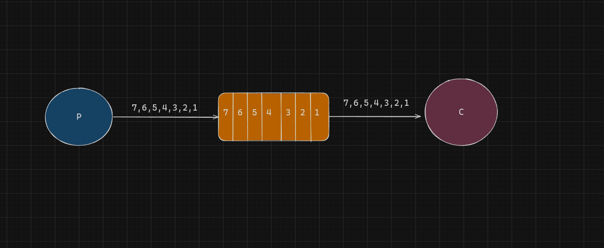
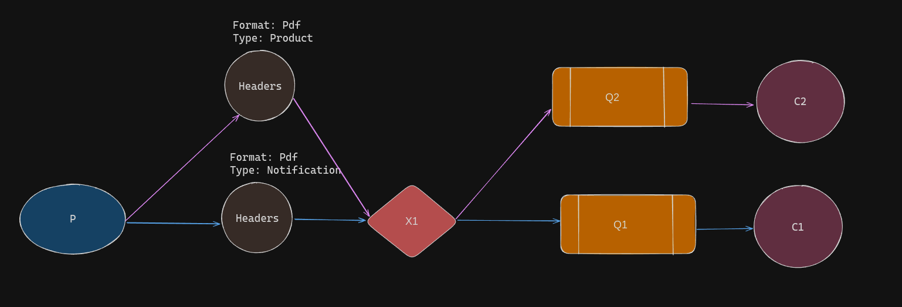

# 01. HELLO CLASS


# 02. WORK QUEUES


# 03. PUB/SUB


# 04. ROUTING


# 05. TOPICS


# 06. RPC ( Remote Procedure Call )


# 07. DLX ( Dead Letter Exchange )


# 08. EVENLY-DIST ( Evenly Distributing )



# 09. HEADERS



# 10. STREAM ( New )

```
         ┌───────────────────┐
         │     Producer      │
         │  (produce.js)     │
         └───────────────────┘
                   |
                   v
        ┌──────────────────────────┐
        │   Stream Queue (Rabbit)  │
        │   type=stream            │
        │   giữ tất cả message     │
        └──────────────────────────┘
                   |
                   v
        ┌──────────────────────────┐
        │       Consumer           │
        │    (consume.js)          │
        └──────────────────────────┘
                   |
        ┌──────────────────────────┐
        │ Data Warehouse (file)    │
        │ dataWarehouse.txt        │
        └──────────────────────────┘
                   |
        ┌──────────────────────────┐
        │ Offset Checkpoint         │
        │ offset.txt                │
        └──────────────────────────┘


```

# 11. DELAYED ( New )

```
          ┌────────────────┐
          │   Producer     │
          └────────────────┘
                   |
                   v
          ┌─────────────────────────────┐
          │   delay_queue_10s           │
          │  (TTL = 10s, DLX → main_ex) │
          └─────────────────────────────┘
                   |
   (Message giữ trong queue 10s)
                   |
      TTL hết hạn (10s trôi qua)
                   |
                   v
          ┌─────────────────────────────┐
          │        main_exchange        │
          │   (direct, routing key=go)  │
          └─────────────────────────────┘
                   |
                   v
          ┌─────────────────────────────┐
          │   delayed_target_queue      │
          │   (nơi Consumer lắng nghe)  │
          └─────────────────────────────┘
                   |
                   v
          ┌────────────────┐
          │   Consumer     │
          │ [✓] nhận msg   │
          └────────────────┘

```

# 12. DLX ( New )

```
            +------------------+
            |   Producer       |
            | (DXL function)   |
            +--------+---------+
                     |
                     v
            +------------------+
            |  main_queue      |<-------------------+
            | (TTL = 5s)       |                    |
            | DLX = dlx_exchange                    |
            +--------+---------+                    |
                     |                              |
         (msg expired or rejected)                  |
                     |                              |
                     v                              |
            +------------------+                    |
            |  dlx_exchange    | (fanout exchange)  |
            +--------+---------+                    |
                     |                              |
                     v                              |
            +------------------+                    |
            | dead_letter_queue|--------------------+
            +------------------+


```

# 13. WORK ( New )

```
   +-------------+          +----------------+        +----------------+
   |             |   task   |                |        |                |
   |  Producer   +--------->+   Queue (tasks)+------->+  Worker 1      |
   |             |          |                |        | (Consumer)     |
   +-------------+          +----------------+        +----------------+
                                                      ^
                                                      |
                                                      |
                                                      v
                                               +----------------+
                                               |  Worker 2      |
                                               | (Consumer)     |
                                               +----------------+

```

# 14. TTL ( New )

```
   [Producer]
       |
       v
 ┌───────────────┐
 │  Queue (msg_ttl_queue) │
 └───────────────┘
       |
       | Message có TTL=5s
       |--------------------------> Nếu Consumer đọc trong 5s → xử lý OK
       |
       └──> Sau 5s -> Message tự động expire -> bị xóa khỏi queue


```

# 15. PRIORITY ( New )

```
                +-------------------+
                |   Producer App    |
                +-------------------+
                         |
     -------------------------------------------------
     |                       |                       |
     v                       v                       v
[Normal ticket]         [VIP ticket]         [Medium ticket]
 priority = 1           priority = 10         priority = 5
     |                       |                       |
     -------------------------+-----------------------+
                               v
                     ┌──────────────────┐
                     │ Priority Queue   │
                     │ (x-max-priority=10)
                     └──────────────────┘
                               |
                               v
                     +--------------------+
                     |   Consumer App     |
                     | (reads by priority)|
                     +--------------------+
                               |
           --------------------------------------------
           |                  |                       |
           v                  v                       v
   Process VIP          Process Medium           Process Normal
      (10)                   (5)                      (1)


```

# 16. EMAIL-RETRY-DLX
```
                 ┌───────────────────┐
                 │   EmailProducer   │
                 └─────────┬─────────┘
                           │
                           ▼
                 ┌───────────────────┐
                 │ ExchangeMain (direct)  
                 │   "email.main.ex" │
                 └─────────┬─────────┘
                           │ routingKey=email
                           ▼
                 ┌───────────────────┐
                 │   QueueMain       │
                 │   "email.main"    │
                 │  DLX → ExchangeRetry
                 └─────────┬─────────┘
                           │
             ┌─────────────┴────────────────┐
             │                              │
     [✓ Success]                      [✗ Fail → reject]
 channel.ack(msg)                 DLX → "email.retry.ex"
                                        │
                                        ▼
                         ┌────────────────────────┐
                         │    QueueRetry          │
                         │    "email.retry"       │
                         │ TTL=10s → DLX → Main   │
                         └─────────┬─────────────┘
                                   │ (sau 10s)
                                   ▼
                         ┌────────────────────────┐
                         │ ExchangeMain           │
                         └─────────┬─────────────┘
                                   │
                                   ▼
                         ┌────────────────────────┐
                         │ QueueMain (retry lần 2)│
                         └────────────────────────┘

        ┌─────────────────────────────────────────────┐
        │ Nếu retryCount >= 3                         │
        │ Worker publish → ExchangeDead (fanout)      │
        │   → QueueDead ("email.dead")                │
        └─────────────────────────────────────────────┘

                           ▼
                ┌──────────────────────┐
                │   EmailDeadConsumer   │
                │   Log/Debug Failures  │
                └──────────────────────┘
```

```
    📝 Giải thích ngắn gọn

    Producer gửi message vào email_exchange.

    email_queue nhận message, consumer sẽ xử lý (gửi email thật).

    Nếu gửi thành công → ACK → message biến mất.

    Nếu gửi thất bại (timeout, lỗi SMTP, …):

    Message sẽ chuyển sang DLX (dlx_exchange).

    DLX đưa message vào retry_queue.

    Sau khi hết TTL (ví dụ 10s), RabbitMQ tự động chuyển lại message về email_exchange để retry.

    Nếu retry quá số lần (ví dụ 3 lần), message sẽ đi vào dead_queue (bỏ hẳn, log lại để dev check).

```